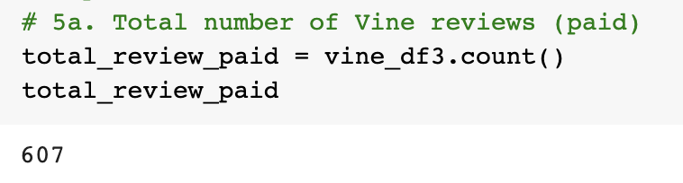
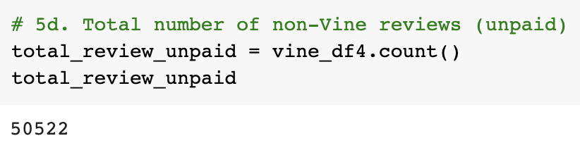
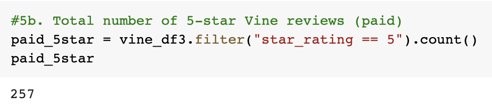
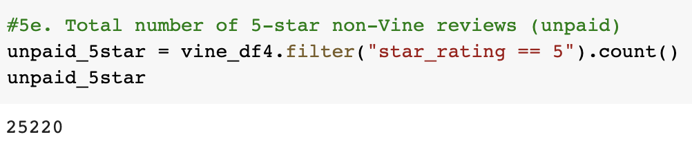
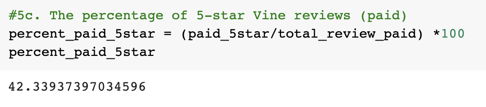
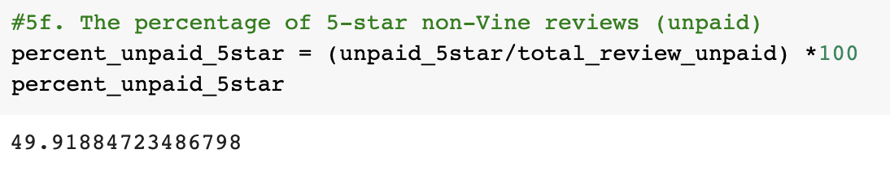

# Amazon_Vine_Analysis
## Overview of the project
The purpose of this project is to analyze Amazon reviews on camera products written by members of the paid Amazon Vine program. The project consists of two tasks:
* Use PySpark to perform the ETL process to extract the dataset, transform the data, connect to an AWS RDS instance, and load the transformed data into pgAdmin. 
* Use PySpark to determine if there is any bias toward favorable reviews from Vine members.

## Results
#### I. How many Vine reviews and non-Vine reviews were there? 

* There are 607 Vine reviews and 50522 non-Vine reviews.
#### II. How many Vine reviews were 5 stars? How many non-Vine reviews were 5 stars? 

* 257 Vine reviews and 25220 non-Vine reviews were 5 star. 
#### III. What percentage of Vine reviews were 5 stars? What percentage of non-Vine reviews were 5 stars?

* 42.3% Vine reviews and 49.9% non-Vine reviews were 5 stars.

## Summary
The summary states whether or not there is bias, and the results support this statement (2 pt)
An additional analysis is recommended to support the statement (2 pt)